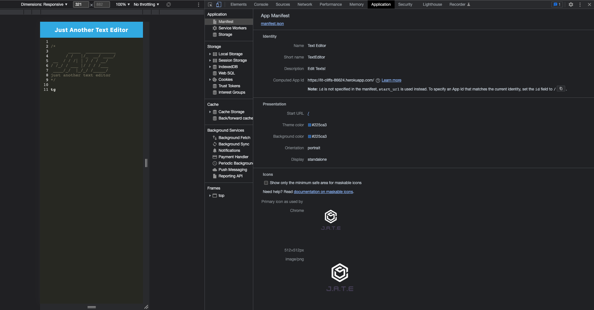

# textEditor
A text editor app running in the browser and offline environment, through PWA (Progressive Web Applications) and IndexedDB database.


## 📋 Description
This project is to create a text editor app, allowing users to use in both online and offline environment. An IndexedDB database, used by tech companies such as Google and Mozilla, is created to store and retrieve data inputed through this text editor. After the editor's focus is lost and exsisting the browser, the indexedDB database provides data persistence. Service Worker is installed to cache pages and assets for offline functionality. Manifest file is injected through webpack, creating parameter of the local installation.

### 📽 Demonstration
Demo video 
* [Application Functionality](https://drive.google.com/file/d/1Urmi4XTTKqBHC9sLZopZJgT_taHMunbm/view?usp=sharing)

### 📷 Screenshots
* Client Dist


* Manifest.json


* Registered Service Workers


* IndexedDB


## 🕹 Technologies
* [Node.js](https://nodejs.org/)
* [express](https://www.npmjs.com/package/express)
* [concurrently](https://www.npmjs.com/package/concurrently)
* [nodemon](https://www.npmjs.com/package/nodemon)
* [indexedDB](https://www.npmjs.com/package/indexeddb)
* [Babel](https://www.npmjs.com/package/Babel)
* [Webpack](https://www.npmjs.com/package/webpack)
* [workbox-webpack-plugin](https://developer.chrome.com/docs/workbox/modules/workbox-webpack-plugin/)

## Installation
Install dependencies
```
npm i
```

## Troubleshooting
Solution to "heroku sh: 1: webpack: not found"
```
heroku config:set NPM_CONFIG_PRODUCTION=false
```

## ⛓ Links
Heroku
https://lit-cliffs-86624.herokuapp.com/

Github
https://github.com/chentriangoes/textEditor

## ☎️ Questions
For any questions about the project/repository please contact me @ [chentriangoes@gmail.com](mailto:chentriangoes@gmail.com) </br>
GitHub @ [chentriangoes](https://github.com/chentriangoes) 